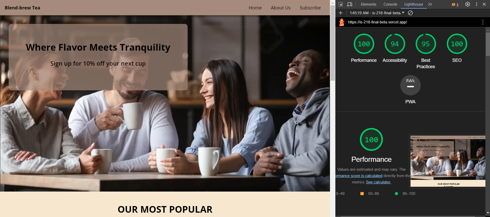
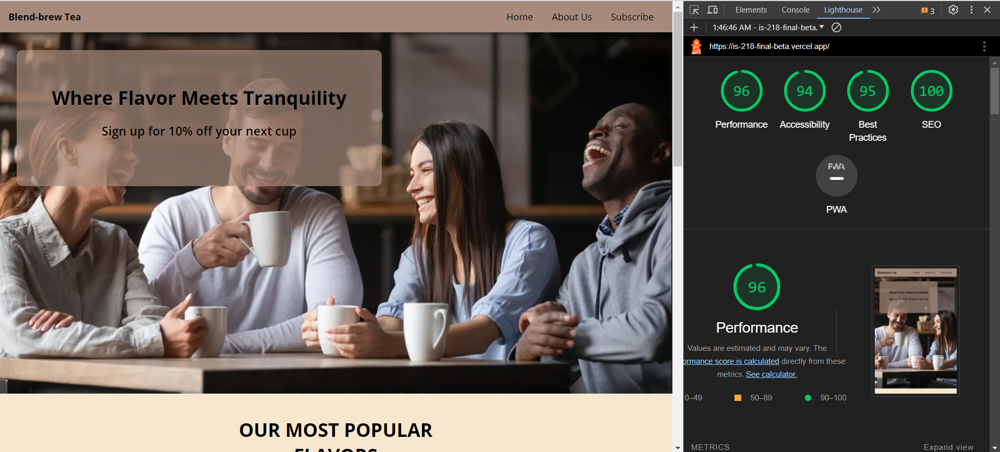

# Website Testing Documentation for BlendBrew Tea Co.

## Automated Testing

### Playwright Tests

Automated tests are essential for ensuring the functionality and performance of the website. Below are the Playwright tests implemented for various components of the BlendBrew Tea Co. website.

```javascript
const { test, expect } = require('@playwright/test');

// Test for the Home page title
test('Home page has the correct title', async ({ page }) => {
  await page.goto('http://localhost:3000');
  await expect(page).toHaveTitle(/Blend-brew Tea/);
});

// Test for SEO description on the Home page
test('Home page has correct SEO description', async ({ page }) => {
  await page.goto('http://localhost:3000');
  const description = await page.getAttribute('meta[name="description"]', 'content');
  expect(description).toBe("Discover the art of fine tea with Blend-brew Tea. Explore our crafted blends for a symphony of flavors.");
});

// Additional tests...
```

### Manual Testing

Manual testing involves visiting the website and manually interacting with its elements to ensure everything is working as intended. Key areas to focus on include:

- Navigation links and buttons
- Form submissions and validations
- Responsiveness and layout on different screen sizes
- Content accuracy and legibility

### Lighthouse Testing

Lighthouse testing assesses the website's performance, accessibility, best practices, and SEO. The target is to achieve scores above 90 in all areas except PWA.


;

## Continuous Improvement

- Regularly update the automated tests to cover new features or updates.
- Schedule frequent manual testing sessions to ensure consistent user experience.
- Use insights from Lighthouse testing to enhance the site's performance and accessibility.
